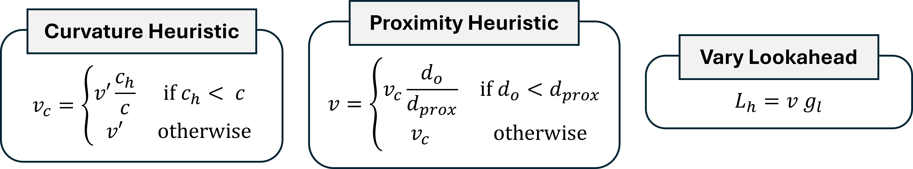
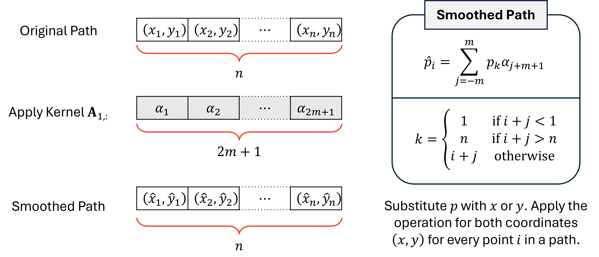

# Designing ROS2 Nav2 Controller and Planner - Autonomous Robot Systems

## Project Objectives
This project focuses on designing and implementing autonomous navigation using the Nav2 framework, specifically a controller and a planner. The goal is to improve upon existing navigation methods by incorporating advanced techniques and ensuring robust performance in both simulation and physical robot environments.

1.  **Regulated Pure Pursuit Controller:** Implemented a regulated pure pursuit controller that enhances the basic pure pursuit algorithm. This includes:
    * Adjusting the robot's velocity based on proximity to obstacles.
    * Ensuring the robot rotates to the desired orientation specified by the user.
2.  **A\* Path Planning and Savitsky-Golay Smoothing:** Developed a path planner using the A\* algorithm and smooth the generated paths using Savitsky-Golay filtering. This involves:
    * Implemented A\* to find an optimal path around obstacles.
    * Applying Savitsky-Golay smoothing to create smoother, more navigable paths.
3.  **Theta\* Path Planing:** Developed a path planner using the Theta\* algorithm. 
4.  **Physical Experiments:** Tested and validated the implemented algorithms on a physical Turtlebot robot. This includes:
    * Mapping a physical playing field using SLAM.
    * Navigating the robot through specified waypoints using the developed planner and controller plugins.
---

## Project Structure
- `src/`: Source files for the controller and planner plugins.
- `controller.cpp` and `controller.hpp`: Implementation of the regulated pure pursuit controller.
- `planner.cpp` and `planner.hpp`: Implementation of the Theta* planner. 
- `planner_astar_sg.cpp` and `planner_astar_sg.hpp`: Implementation of the A* planner with savitsky-golay smoothing. 
- `proj1.yaml`: Configuration file for parameters.
- `README.md`: README file.

---

## Key Features
✅ **Regulated Pure Pursuit Controller**  
✅ **Rotation to Goal Orientation**  
✅ **A\* Path Planning**  
✅ **Savitsky-Golay Path Smoothing**  
✅ **Theta\* Path Planning**  
✅ **Physical Robot Testing and Tuning**  

---

## Implementation Details

### 1. Regulated Pure Pursuit

The regulated pure pursuit controller adjusts the robot's behavior based on several heuristics, as shown in the following formula:



Where:

* $c\_h$ is the curvature threshold.
* $d\_{prox}$ is the proximity threshold.
* $g\_l$ is the lookahead gain.
* $v'$ is the desired linear velocity.
* $d\_o$ is the distance to the closest obstacle.
* $L\_h$ is the adjusted lookahead distance.

The controller uses these parameters to modify the robot's linear and angular velocities, ensuring smooth and safe navigation.

### 2. A\* Path Planning and Savitsky-Golay Smoothing

#### A\* Algorithm

The A\* algorithm is implemented to find the shortest path from a start point to a goal point, avoiding obstacles. The algorithm uses a costmap to represent the environment and calculates the cost of moving from one cell to another.

#### Savitsky-Golay Smoothing

The Savitsky-Golay filter smooths the path generated by A\* by fitting a polynomial curve over a moving window of points. The formula for calculating the smoothed point $\hat{x}\_i$ is:



Where:

* $\mathbf{J}$ is the Vandermonde matrix.
* $\mathbf{A} = (\mathbf{J}^\top \mathbf{J})^{-1}\mathbf{J}^\top$ is the kernel of the polynomial fit.
* $\mathbf{A}\_{1,:}$ is the first row of $\mathbf{A}$.
* $x\_i$ is a coordinate of the $i$-th point along a path.

### 3. Theta\* Path Planing

Theta* Planner: While A* finds grid-based paths, the Theta* algorithm enhances this by allowing line-of-sight connections between non-adjacent nodes. This "corner-cutting" capability results in shorter and smoother paths, which are often more efficient and natural for robot navigation than strictly grid-aligned trajectories.

## Software Requirements
1. Ubuntu 22.04 with ROS2 Humble

## Installation and Usage Instructions
1. In Ubuntu, open a terminal with `Ctrl+Alt+T`.

2. On the terminal, clone the GitHub repository:
    ```bash
    mkdir ros2_ws
    cd ~/ros2_ws
    git clone https://github.com/godheinstein/Autonomous_Navigation_ROS2.git
    ```
3. Let the `ros2_ws` folder be known as the **workspace** folder. Navigate into the workspace folder, and build the files.
   ```bash
   cd ~/ros2_ws
   colcon build --symlink-install
   ```
    Wait for about a minute.

## Setup Networking

1.  **Connect to the Turtlebot:** Ensure your remote PC is connected to the same Wi-Fi network as the Turtlebot.
2.  **Set ROS Domain ID:** Make sure the `ROS_DOMAIN_ID` is consistently set on both the Turtlebot and the remote PC.


## Mapping the environment with SLAM_toolbox

### 1. SSH into Turtlebot
This section assumes both the Turtlebot and Remote PC are connected to the same Wi-Fi.

1. Open a new terminal on your Remote PC.

2. Connect to the Turtlebot by running
    ```bash
    ssh ubuntu@<TURTLE_IP>
    ```
    where `<TURTLE_IP>` is the Turtlebot's IP address.

3. This enables access to the Turtlebot without connecting the keyboard and monitor. The caveat however is that the Turtlebot's IP address has to be known, and that the Turtlebot is connected to the Wi-Fi. 

4. To exit the SSH, run the command `exit` or press `Ctrl+D`. Do not exit if you are doing this section for this first time.

### 2. Running the Turtlebot Bringup
The Turtlebot bringup starts up the sensors, publishes sensor data into ROS2, and enables tele-operation. 

1. Remove the keyboard and monitor if they are connected to the Turtlebot.

2. Make sure that the battery or the DC jack is plugged in to the Turtlebot.

3. Place the robot on a flat surface.

4. On the **Turtlebot SSH terminal**, run the command to begin sensor calibration and bringup the robot. Do not touch or shake the robot until the `Run!` word is shown, as the Gyro sensor is calibrating.
    ```bash
    ros2 launch turtlebot3_bringup robot_c1.launch.py
    ```
5. You may now begin using the robot. To interrupt the program *later*, `Ctrl+C` can be used.

### 3. Running the SLAM operation
This section assumes that the Turtlebot and the Remote PC are connected to the same Wi-Fi,
the `ROS_DOMAIN_ID` for the robot and PC are the same. 

1. Plug in the battery and remove any physical connections to the Turtlebot.

2. Make sure that the robot is placed at the origin point of a new area to map, and that the robot is pointing along the positive $x$-axis of the map.

3. Ensure that the Turtlebot bringup is running via SSH.

4. On a **Remote PC terminal**, go to the workspace and launch the following:
    ```bash
    cd ~/ros2_ws
    source install/setup.bash
    ros2 launch ee4308_bringup proj1_slam.launch.py
    ```

5. On another **Remote PC terminal**, run the teleoperation:
    ```bash
    ros2 run turtlebot3_teleop teleop_keyboard
    ```

6. Begin mapping the area like in the simulations.

7. Once the area is mapped, interrupt the remote PC terminal running the teleoperation with `Ctrl+C`.

8. In the same terminal, save the map with:
    ```bash
    ros2 run nav2_map_server map_saver_cli -f ~/ros2_ws/src/ee4308_bringup/maps/my_map
    ```

9. After the map is saved, install the map by building the workspace:
    ```bash
    cd ~/ros2_ws
    colcon build --symlink-install
    ```

10. All terminals can now be interrupted with `Ctrl+C`.

## Autonomous Navigation 
1.  **Navigation:** Once the map is created, you can navigate the robot within the mapped environment.

2. Place the Turtlebot in a part of the map where you want to start it.

3. Ensure that the Turtlebot bringup is running via SSH.

4. On a **Remote PC terminal**, go to the workspace and launch the following:
    ```bash
    cd ~/ros2_ws
    source install/setup.bash
    ros2 launch ee4308_bringup proj1.launch.py
    ```

5. **Estimate Initial Pose:** Use RViz to estimate the initial pose of the robot using the `2D Pose Estimate` tool.

6. **Send Navigation Goals:** Send navigation goals to the robot using the `Nav2 Goal` tool in RViz.

7. To end the ros2 nodes, all terminals can be interrupted with `Ctrl+C`.